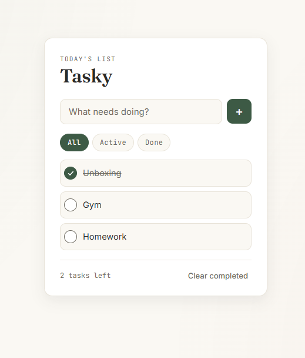

# Tasky 📝

A small, fast, dependency-free to-do list that runs entirely in your browser. No backend, no build step, no tracking — just open `index.html` and start working.


## Features

- **Add, complete, and delete tasks** with smooth, lightweight animations
- **Inline editing** — double-click any task to rename it, `Enter` to save, `Esc` to cancel
- **Filters** — view All, Active, or Done tasks
- **Live counter** of remaining tasks
- **Clear completed** in one click
- **Persistent storage** — tasks are saved to `localStorage`, so your list survives a page refresh
- **Keyboard friendly** — add tasks with `Enter`, full focus states for keyboard navigation
- **Accessible** — semantic roles, `aria-live` updates, and visible focus rings
- **Responsive** — comfortable on phones and desktops alike
- **Zero dependencies** — vanilla HTML, CSS, and JavaScript; no frameworks, no build tools

## Demo



## Getting started

Tasky has no dependencies and no build step.

```bash
git clone https://github.com/Nicoguglielmii/tasky.git
cd tasky
```

Then either:

- **Open directly** — double-click `index.html`, or
- **Serve locally** (recommended, avoids any browser file:// quirks):

  ```bash
  # Python 3
  python3 -m http.server 8000

  # or Node
  npx serve .
  ```

  Then visit `http://localhost:8000`.

## Project structure

```
tasky/
├── docs/
│   └── screenshot.png   # App screenshot used in this README
├── index.html           # Markup and the inline task template
├── style.css            # Design tokens, layout, and component styles
├── script.js            # App state, rendering, and event handling
└── README.md
```

## How it works

Tasks are kept as a simple array of plain objects in memory and mirrored to `localStorage` on every change:

```js
{ id: "uuid", text: "Buy milk", completed: false, createdAt: 1719399999000 }
```

Rendering is a straightforward re-render of the visible (filtered) tasks into the `<ul>` on every state change — there's no virtual DOM and no framework, which keeps the codebase small and easy to follow.

## Roadmap

Ideas for future improvements — contributions welcome:

- [ ] Drag-and-drop reordering
- [ ] Due dates and reminders
- [ ] Tags or categories per task
- [ ] Dark mode toggle
- [ ] Export / import tasks as JSON
- [ ] Sync across devices (optional backend)

## Contributing

Issues and pull requests are welcome. For larger changes, please open an issue first to discuss what you'd like to change.

1. Fork the repo
2. Create a branch (`git checkout -b feature/my-feature`)
3. Commit your changes (`git commit -m "Add my feature"`)
4. Push to the branch (`git push origin feature/my-feature`)
5. Open a pull request

## License

This project is licensed under the [MIT License](LICENSE).
